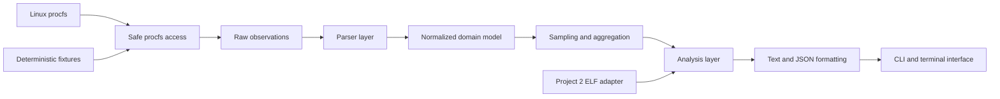

# ProcLens System Architecture

## Document status

- Project: ProcLens
- Repository: `linux_process_memory_explorer`
- Milestone: Milestone 0
- Status: Initial architecture
- Primary platform: Linux
- Primary development environment: Kali Linux under WSL2
- Language: C++20

## 1. Purpose

This document defines the initial architecture for ProcLens, a read-only Linux
process and virtual-memory inspection system.

The architecture is intended to support:

- a reusable C++ process-inspection library;
- a command-line application;
- deterministic parser testing;
- live Linux procfs inspection;
- partial-result reporting;
- text and JSON presentation;
- future sampling, snapshots, and analysis;
- optional ELF integration with Project 2.

Milestone 0 establishes these boundaries without implementing substantive
procfs parsing.

## 2. Architectural drivers

The design is shaped by the following realities:

1. procfs is live and changes while it is being inspected;
2. processes can exit between any two reads;
3. PIDs can eventually be reused;
4. procfs files differ in syntax and units;
5. some data may be permission-restricted;
6. kernel versions may expose different fields;
7. process information may be sensitive;
8. live kernel interfaces are difficult to test deterministically;
9. CLI presentation must not be mixed with parsing;
10. the library must remain independently reusable.

## 3. High-level data flow



The same parser and model layers must support both:

- live Linux procfs data; and
- deterministic fixture data.

This allows tests to reproduce parser behavior without depending entirely on
the current machine state.

## 4. Layered architecture

### 4.1 Platform and procfs access layer

Responsibilities:

- represent the procfs mount point;
- validate process identifiers before path construction;
- construct paths without shell commands;
- read bounded procfs content;
- read symbolic links safely;
- enumerate directories;
- capture operating-system errors;
- distinguish missing, denied, malformed, and transient observations.

Possible future components:

```text
include/proclens/procfs/mount.hpp
include/proclens/procfs/file_reader.hpp
include/proclens/procfs/symlink_reader.hpp
include/proclens/procfs/directory_reader.hpp
src/procfs/
```

This layer must not interpret fields such as CPU time, memory size, or process
state. It only obtains raw observations.

### 4.2 Parser layer

Responsibilities:

- parse individual procfs interfaces;
- validate syntax and field counts;
- preserve raw values where useful;
- convert fields into strongly typed intermediate representations;
- identify malformed content;
- tolerate optional or kernel-version-specific fields;
- avoid presentation decisions.

Possible parsers include:

```text
stat_parser
status_parser
maps_parser
smaps_parser
limits_parser
io_parser
system_stat_parser
task_reader
fd_reader
```

Each parser should be independently testable using fixtures.

### 4.3 Domain-model layer

Responsibilities:

- represent process identity;
- represent process metadata;
- represent CPU counters;
- represent memory values with explicit units;
- represent threads;
- represent mappings;
- represent file descriptors;
- represent resource limits;
- represent unavailable values;
- preserve diagnostics associated with partial data.

Possible future models include:

```text
ProcessId
ProcessIdentity
ProcessInfo
ThreadInfo
CpuSample
MemorySummary
MemoryMapping
FileDescriptor
ResourceLimit
ProcessSnapshot
```

Models must not depend on terminal formatting.

### 4.4 Sampling and aggregation layer

Responsibilities:

- gather repeated observations;
- use monotonic timestamps;
- calculate deltas;
- detect process disappearance;
- detect possible PID reuse;
- calculate CPU usage;
- calculate I/O deltas;
- calculate page-fault deltas;
- combine data into partial process snapshots;
- bound retained history.

This layer becomes important during CPU monitoring and watch-mode milestones.

### 4.5 Analysis layer

Responsibilities:

- construct process trees;
- classify mappings;
- correlate executable and shared-library mappings;
- compare snapshots;
- filter and sort processes;
- explain derived results and uncertainty;
- optionally correlate Project 2 ELF metadata.

Analysis must preserve the underlying raw observations and avoid presenting
inference as certainty.

### 4.6 Formatting and serialization layer

Responsibilities:

- human-readable tables;
- detailed text output;
- stable JSON serialization;
- explicit units;
- schema versions;
- representation of unavailable values;
- deterministic output for golden tests.

Formatting receives domain objects and analysis results. It must not read
procfs directly.

### 4.7 CLI and terminal layer

Responsibilities:

- parse command-line arguments;
- validate command combinations;
- select output format;
- invoke library operations;
- manage watch loops;
- manage terminal behavior;
- choose exit codes;
- render diagnostics.

The CLI must remain thin. It should coordinate operations rather than contain
procfs parsers or business logic.

## 5. Planned build targets

### 5.1 `proclens_core`

A reusable C++ library.

Milestone 0 responsibilities:

- provide version information;
- provide build and platform identity;
- establish the stable public include structure.

Future responsibilities:

- procfs access;
- parsers;
- domain models;
- sampling;
- analysis;
- serialization support.

### 5.2 `proclens`

The command-line application.

Milestone 0 responsibilities:

- launch successfully;
- display product and version information;
- link against `proclens_core`.

Future responsibilities:

- expose ProcLens commands;
- select text or JSON output;
- control sampling and watch behavior;
- report diagnostics and exit codes.

### 5.3 `proclens_smoke_tests`

A zero-feature test executable.

Milestone 0 responsibilities:

- include the public library header;
- link against `proclens_core`;
- verify version invariants;
- run through CTest.

Future tests will be split among unit, integration, regression, golden, and
stress responsibilities.

## 6. Source-tree mapping

```text
include/proclens/
    Public library headers.

src/
    Library implementation.

tools/proclens/
    CLI implementation.

tests/unit/
    Deterministic unit and parser tests.

tests/integration/
    Controlled live-process tests.

tests/regression/
    Permanent tests for confirmed defects.

tests/golden/
    Stable text and JSON output tests.

tests/stress/
    Process churn, repeated sampling, and mapping-heavy tests.

fixtures/procfs/
    Sanitized deterministic procfs content.

fixtures/expected/
    Expected normalized or formatted results.

fixtures/snapshots/
    Stable process snapshot examples.

docs/
    Architecture, platform, security, development, and ADR records.

cmake/
    Reusable compiler, sanitizer, and analysis policies.

schemas/
    Versioned JSON schemas.

scripts/
    Repeatable developer and CI workflows.
```

## 7. Process identity model

A PID alone is not a permanent process identity.

The future identity model should use at least:

```text
process identifier
+
process start time obtained from procfs
```

Additional contextual information may include:

- system boot identifier;
- executable identity;
- command name;
- PID namespace context.

The initial design will treat PID plus process start time as the core identity
within one system boot.

If the same PID is observed with a different start time between samples, the
sampling layer must treat it as a different process.

## 8. Partial-result model

ProcLens must not assume that every requested field can be collected.

A process snapshot may contain:

```text
available data
+
unavailable sections
+
warnings and diagnostics
```

Examples include:

- metadata available while mappings are permission denied;
- process metadata collected before the process exits;
- file-descriptor enumeration interrupted by process termination;
- an optional kernel field being absent;
- one malformed line within otherwise usable input;
- an executable symbolic link being unavailable.

A partial result should remain usable unless strict mode explicitly requires
all requested sections.

The model must distinguish:

- unavailable information;
- unavailable interfaces;
- permission-denied information;
- malformed information;
- legitimate numeric zero values.

## 9. Error categories

The initial architectural error categories are:

- invalid process identifier;
- process not found;
- process exited during observation;
- permission denied;
- interface unavailable;
- malformed procfs content;
- unsupported field or kernel variation;
- symbolic-link failure;
- integer overflow;
- I/O failure;
- partial snapshot;
- internal invariant violation.

The final public representation will be resolved during Milestone 1 through an
Architecture Decision Record and dedicated error model.

## 10. Unit and precision policy

ProcLens must never assume that all Linux accounting fields use the same unit.

Future internal types should preserve:

- bytes;
- KiB values reported by procfs;
- pages;
- clock ticks;
- monotonic durations;
- CPU counter units;
- timestamps with documented clock sources.

Conversion must be explicit and overflow-checked.

The implementation must obtain relevant system values, such as page size and
clock ticks per second, from documented operating-system interfaces rather
than assuming the audited development-machine values apply universally.

Unavailable values must not be represented as numeric zero.

## 11. Threading policy

Milestone 0 introduces no concurrency.

Initial live sampling should prefer a simple single-threaded design unless
measured requirements justify concurrency.

If concurrency is later introduced:

- ownership must remain explicit;
- shared mutable state must be minimized;
- shutdown must be deterministic;
- bounded queues or histories must be used;
- ThreadSanitizer must be included in validation;
- thread-safety guarantees must be documented;
- terminal rendering must not race with sample collection.

Concurrency will be introduced only to solve a demonstrated architectural or
performance need, not merely to make the design appear sophisticated.

## 12. Security boundaries

ProcLens is a read-only inspection system.

The architecture prohibits:

- arbitrary process-memory reads;
- process-memory modification;
- process control;
- signal injection;
- `ptrace` attachment;
- privilege escalation;
- access-control bypass;
- shell execution using inspected data.

Paths, command lines, symbolic-link targets, and other strings obtained from
procfs must be treated as untrusted text.

The implementation must:

- preserve operating-system permission failures;
- avoid requiring root for normal operation;
- avoid collecting complete process environments by default;
- avoid executing or interpolating inspected text into shell commands;
- bound reads where practical;
- avoid following assumptions based on stale symbolic-link targets;
- report partial data honestly;
- keep generated live snapshots out of version control by default.

Sensitive fields may require explicit command-line options and documentation
before they are exposed.

## 13. Project 2 integration boundary

Project 2 ELF support is optional.

A future adapter may provide:

```text
runtime executable path
    ↓
Project 2 ELF inspection interface
    ↓
loadable-segment metadata
    ↓
ProcLens mapping correlation
```

The core ProcLens library must not require Project 2 unless:

- Project 2 exposes a stable public API;
- dependency management remains clean;
- the capability adds clear diagnostic value;
- standalone ProcLens builds remain possible;
- the integration does not confuse ELF sections with runtime mappings.

The integration decision must be documented through an Architecture Decision
Record before implementation.

## 14. Project 1 experimental relationship

Project 1 is not a direct ProcLens dependency.

Its allocator workloads may later generate controlled observations such as:

- heap growth;
- anonymous mapping creation;
- resident-memory changes;
- page-fault changes;
- mapping creation and removal;
- alignment-sensitive allocation behavior.

These experiments belong in:

- examples;
- controlled integration tests;
- performance experiments;
- portfolio demonstrations.

Allocator implementation details must not enter the ProcLens core architecture
unless a later requirement clearly justifies them.

## 15. Testing architecture

### 15.1 Deterministic tests

Fixtures will be used for:

- parser syntax;
- malformed fields;
- optional fields;
- unit conversions;
- integer-overflow behavior;
- mapping classification;
- serialization;
- snapshot comparison;
- stable diagnostic formatting.

### 15.2 Controlled integration tests

Controlled child processes will eventually:

- sleep;
- consume CPU;
- allocate memory;
- create threads;
- open files and pipes;
- map files;
- create anonymous mappings;
- perform I/O;
- exit during inspection.

### 15.3 Live validation

Representative ProcLens output will be compared with:

- raw `/proc` files;
- `ps`;
- `top`;
- `pidstat`;
- `pmap`;
- `lsof`;
- `strace`.

Differences must be investigated rather than automatically classified as
ProcLens defects. Linux tools may use different sampling windows, accounting
formulas, units, rounding rules, permissions, or data sources.

## 16. WSL and native Linux boundary

WSL2 provides a real Linux kernel and a usable procfs environment, but it is not
identical to a native Linux installation.

Important WSL2 characteristics include:

- visible processes are Linux-side processes;
- Windows host processes are not ordinary Linux procfs entries;
- CPU and memory resources may be virtualized or dynamically assigned;
- device behavior may differ from native Linux;
- Windows-mounted filesystems may have different performance and permission
  behavior;
- performance-counter access may be restricted;
- the WSL kernel configuration is maintained by Microsoft;
- native container, cgroup, namespace, and NUMA behavior requires separate
  validation.

The primary development repository therefore remains under:

```text
/home/fonke/linux_process_memory_explorer
```

rather than a Windows-mounted path such as `/mnt/c`.

Development may occur under WSL2, but WSL validation must not be presented as
proof of universal native-Linux compatibility.

## 17. Milestone 0 implementation architecture

Milestone 0 implements only the following foundation:

```text
proclens_core
    version and platform foundation

proclens
    zero-feature CLI startup

proclens_smoke_tests
    compilation, linking, execution, and CTest proof
```

Milestone 0 does not implement:

- process discovery;
- procfs file readers;
- procfs parsers;
- process identity logic;
- CPU sampling;
- memory accounting;
- mapping inspection;
- thread inspection;
- file-descriptor inspection;
- snapshots;
- snapshot comparison;
- JSON serialization;
- terminal monitoring.

These capabilities begin only after the environment, architecture, error
direction, privacy policy, build system, tests, and CI are established.

## 18. Future architecture checkpoints

The architecture must be reviewed before:

- freezing the public `ProcessId` type;
- freezing process identity semantics;
- freezing the error and diagnostic model;
- freezing the partial-result model;
- implementing CPU-utilization calculations;
- implementing mapping classification;
- versioning the JSON snapshot schema;
- introducing concurrency;
- selecting an interactive terminal library;
- integrating Project 2;
- changing sensitive-information defaults;
- tagging version `v1.0.0`.

Material changes at these checkpoints require an Architecture Decision Record.

## 19. Architecture invariants

The following rules must remain true:

1. CLI code does not parse procfs.
2. Formatters do not read procfs.
3. Parsers do not print to the terminal.
4. Domain models preserve unavailable values separately from zero.
5. Live procfs access is replaceable with fixture-backed input for tests.
6. The library remains independently usable without the CLI.
7. Inspected data is treated as untrusted.
8. Process disappearance does not crash the application.
9. Mapping classification preserves uncertainty.
10. Project 2 integration remains optional unless explicitly changed.
11. Unit conversions remain explicit and overflow-checked.
12. PID reuse is considered whenever observations span time.
13. Permission denial is reported rather than bypassed.
14. Sensitive information is minimized by default.
15. Concurrency is introduced only when justified by measured requirements.

## 20. Initial architecture approval criteria

The Milestone 0 architecture is considered ready for implementation when:

- the project charter and architecture agree;
- the library and CLI boundaries are clear;
- the testing model supports deterministic fixtures;
- partial failure is an explicit design requirement;
- Linux and WSL boundaries are documented;
- security and privacy restrictions are explicit;
- build targets are defined;
- foundational ADRs exist;
- a zero-feature build can validate the target relationships.

Approval of this architecture authorizes only Milestone 0 foundation code. It
does not authorize substantive procfs parser implementation.
